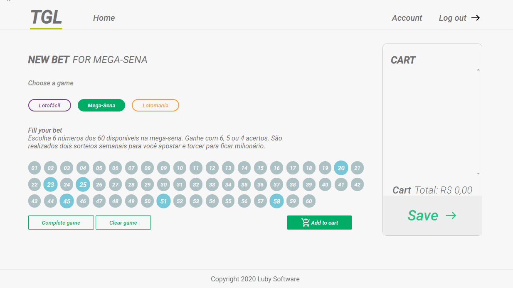

# Teste final de Javascript

- Fiz meu projeto baseado nas seguintes classes:
    
    - GamePanelControl: Responsável por gerenciar o design e as regras para cada tipo de jogo.

    - CartGameControl: Responsável por gerenciar o carrinho de compras de cada jogo.

    - RequestRules: Responsável por fazer uma requisição HTTP para capturar todas as regras disponíveis do arquivo JSON.

    - Util: Classe com alguns métodos avulsos, mas que são úteis ( por isso Util :v kkkkkkk)

- Sim, acredito que ainda conseguiria criar mais classes e separar melhor as responsabilidades das duas primeiras classes citadas, deixarei isso como um próximo desafio para mim :D.

- Em todo o projeto me preocupei com a responsividade, pode ter uma falha de centralização de algum componente aqui ou ali, mas busquei garantir que a página não quebrasse em telas menores.

- Acabei utilizando o JSON-SERVER para transformar o arquivo JSON em um "mini" servidor para que eu possa consumir este arquivo como o protocolo HTTP.

## Vizualização no desktop


## Vizualização no mobile


## Como rodar o projeto?

1º Clone este repositório:
```
git clone https://github.com/henricker/exam-javascript.git
```
2º Instale o json-server
```
npm i -g json-server
```
3º Abra a pasta do repositório e rode o seguinte comando:
```
json-server data/rules.json
```
4º Abra o arquivo index.html no browser do seu navegador.

5º Fique a vontade para testar, fuçar, mexer...

## Conclusão

- O curso JavaScript Ninja e o LabLuby Js me proporcionaram muito conhecimento, acabei entendendo muitas coisinhas do JS que eu nem sabia que existia.

- Melhorei o entendimento do paradigma funcional, os conceitos de clousure functions, callback e outras coisas que não via em outras linguagens.

- Passei FINALMENTE compreender como funciona o uso de threads do JS, event looping e a sua thread principal.

- RESUMINDO, foi muito aprendizado que se contar tudo esse README não termina nunca.